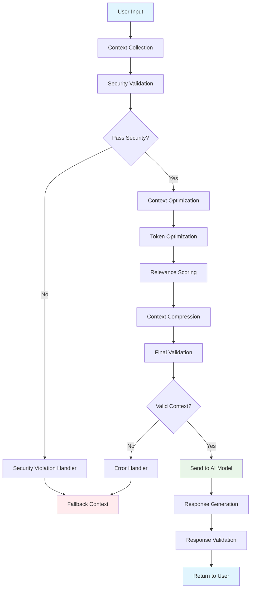
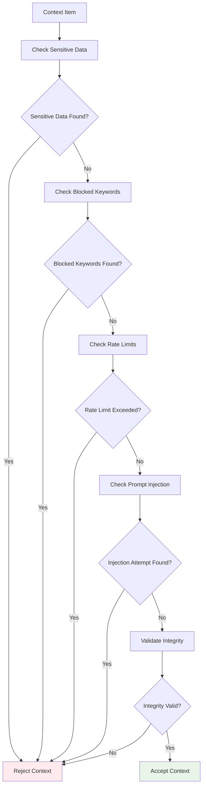
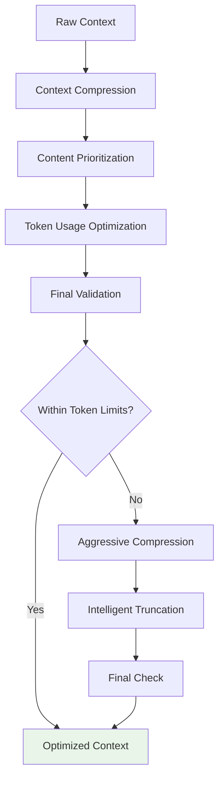
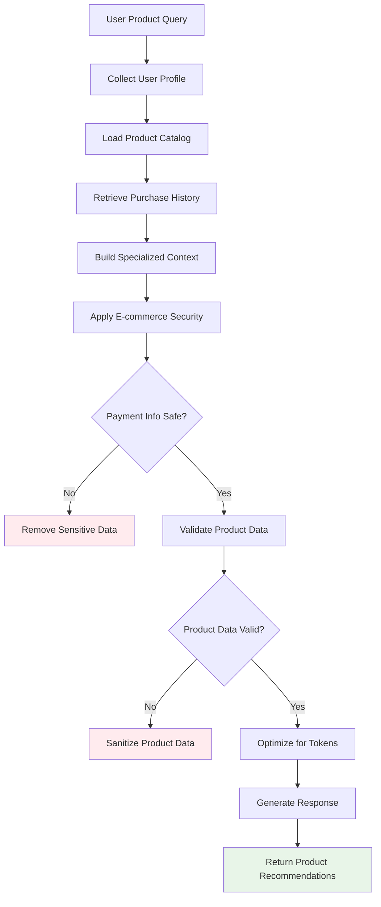
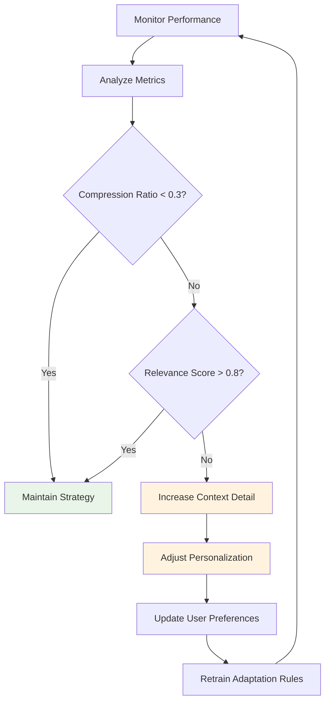
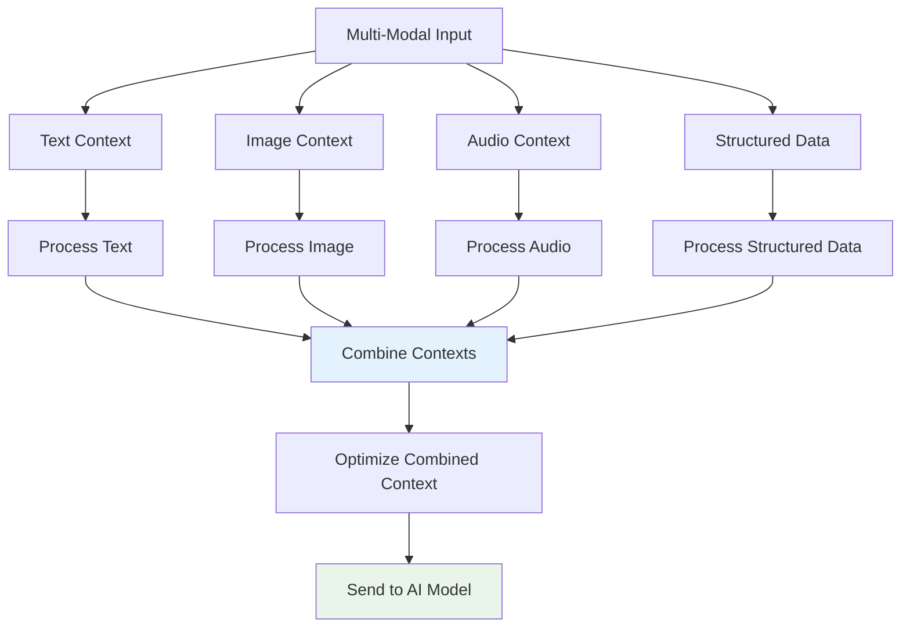
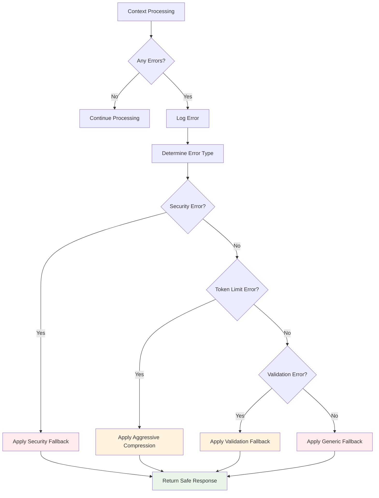
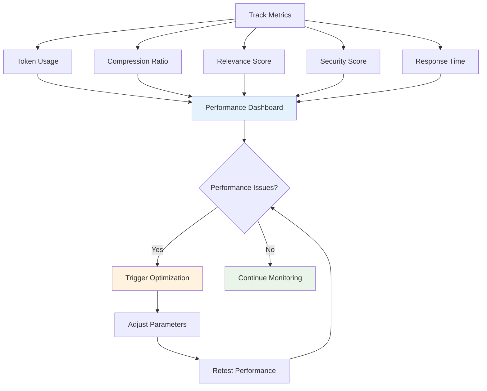

# Context Engineering System Flowchart

## System Architecture Flow

## Security Validation Flow

## Optimization Pipeline Flow

## Real-World E-commerce Flow

## Adaptive Context Engineering Flow

## Multi-Modal Context Processing Flow

## Error Handling and Recovery Flow

## Performance Monitoring Flow

